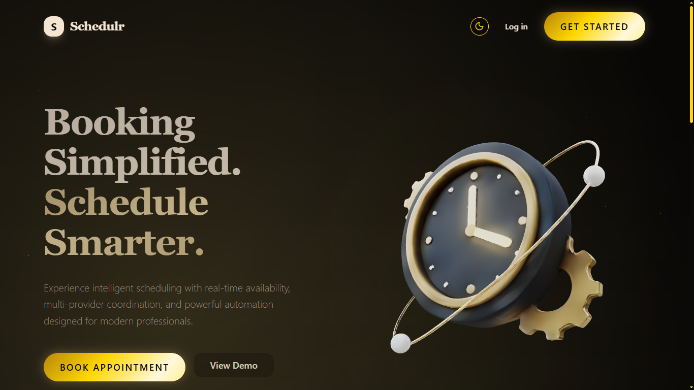
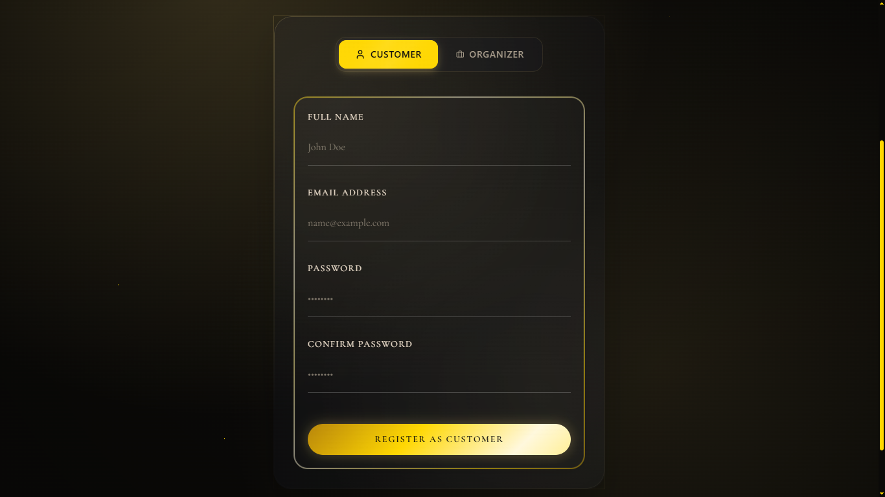

# SchedulR

> **Booking Simplified. Schedule Smarter.**

SchedulR is a comprehensive, multi-role appointment booking and management platform designed to streamline scheduling for businesses, staff, and customers. From complex staff availability to automated refund policies, SchedulR handles the end-to-end booking lifecycle with precision.

---

## 📽️ Project Overview

Check out the project in action:
[YouTube Video Link](https://youtu.be/m92FbcjDhIg?si=DQo9t8ao4W4AKLuU)

---

## 🖼️ Project Preview

### 🏠 Landing Page

The landing page serves as the professional entry point for SchedulR, highlighting its core scheduling capabilities.

### 📝 Registration

Users can register as either a Customer or an Organizer to access tailored dashboard features.

### 🔑 Login & Role Redirection

The secure login system automatically detects user roles and redirects them to their respective dashboards.

### 👤 Customer Dashboard

The customer dashboard provides a streamlined overview of upcoming appointments and easy access to booking history.

### 📅 Booking Management

Customers can manage their personal schedules, reschedule slots, and track the status of their service requests.

---

## 👥 User Roles & Permissions

SchedulR is built with a robust role-based access control (RBAC) system to cater to different organizational needs:

### 🛡️ Admin
The system overseer with full control over the platform.
- **User Management:** Monitor, activate/deactivate accounts, and manage user roles.
- **Global Overview:** Access system-wide statistics and dashboard analytics.
- **Appointment Oversight:** View and manage every appointment across the system.

### 🏢 Organiser
The business owner or department head who manages the operational side of bookings.
- **Booking Management:** Confirm, reject, or complete bookings manually.
- **Dynamic Scheduling:** Reschedule or cancel appointments with automated logic.
- **Calendar View:** A dedicated visual interface to track all scheduled slots.
- **Resource Management:** Manage the resources (rooms, equipment, etc.) linked to appointments.

### 🧑‍💼 Staff
The service providers who carry out the appointments.
- **Availability Management:** Define precise working hours and manage personal schedules.
- **Exception Handling:** Set specific dates or times as "unavailable" (e.g., vacations or breaks).
- **Personal Dashboard:** View upcoming tasks and daily schedules.

### 👤 Customer
The end-user seeking to book services.
- **Seamless Booking:** Browse appointment types and book slots in a few clicks.
- **Self-Service:** Manage personal bookings, including cancellation and rescheduling.
- **Payment Integration:** Secure payment confirmation and automated refund handling for cancellations.
- **Custom Questionnaires:** Simple response handling for appointment-specific requirements.

---

## ✨ Key Features

- **Lifecycle Automation:** Automated flows for booking creation, confirmation, and completion.
- **Smart Cancellations:** Built-in refund calculation logic based on time-to-appointment.
- **Custom Appointment Types:** Create various appointment styles with tailored questions (Multiple choice, Dropdowns, Date, etc.).
- **Real-time Notifications:** Email alerts for booking confirmations and password resets.
- **Responsive Design:** A modern, mobile-friendly interface for both management and booking.

---

## 🛠️ Tech Stack

- **Frontend:** Next.js (App Router), React, TypeScript, Redux Toolkit, Tailwind CSS
- **Backend:** Node.js, Express, Prisma (ORM)
- **Database:** PostgreSQL
- **Utilities:** Framer Motion (Animations), Nodemailer (Emails), Cloudinary (Image Storage)

---

## 🚀 Quickstart (Development)

### Prerequisites
- Node.js (>= 18)
- PostgreSQL
- npm or yarn

### 1. Setup Backend
1. Navigate to `backend/`.
2. Install dependencies: `npm install`.
3. Create a `.env` file (refer to `.env.example`).
4. Run migrations: `npm run migrate`.
5. Start server: `npm run dev`.

### 2. Setup Frontend
1. Navigate to `frontend/`.
2. Install dependencies: `npm install`.
3. Create a `.env.local` file with `NEXT_PUBLIC_API_URL=http://localhost:5000`.
4. Start application: `npm run dev`.

---

## 📜 License

This project is provided for educational and demonstration purposes.
